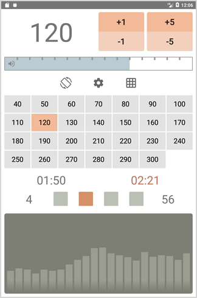
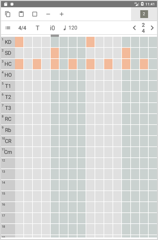
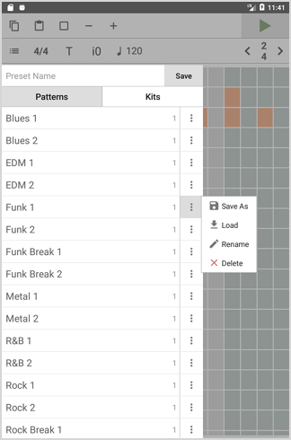
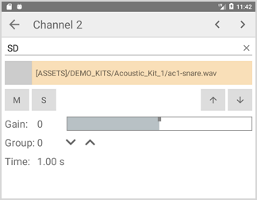

# Metronomix

A drum metronome with a sample-based sequencer.

If you'd like to make a donation via **PayPal** or with a **Credit Card**:  

## Features

- adjustable tempo with buttons and presets
- metronome counters: number of bars played, global time and loop time duration
- audio spectrum visualization during the playback
- 4x16 sequencer allows to create various rhythm patterns

## Download

- [**Metronomix**](https://play.google.com/store/apps/details?id=org.mortalis.metronomix) on **Google Play**
- [**demo releases**](https://github.com/mortalis13/Metronomix/releases)

## Screenshots

  
  
  
  
